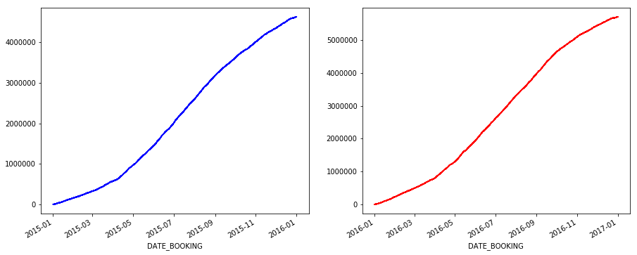
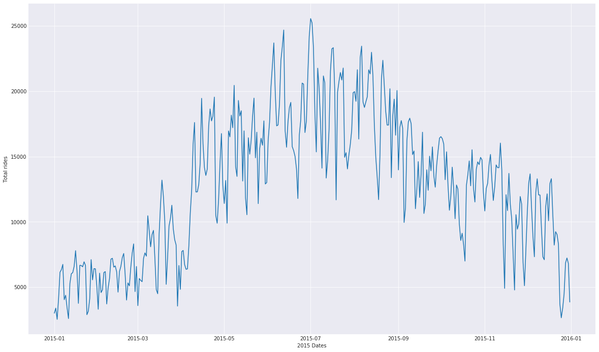
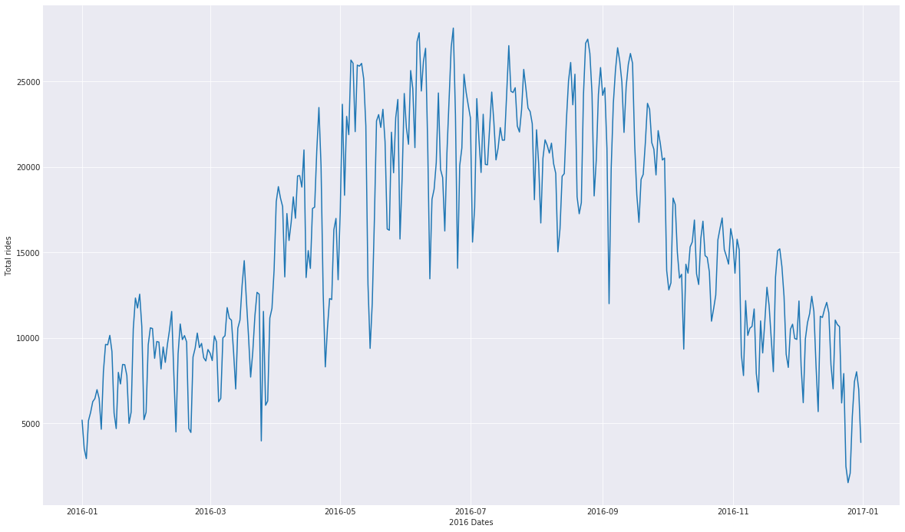
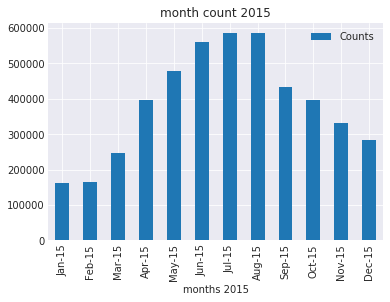
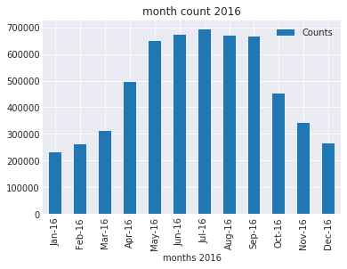
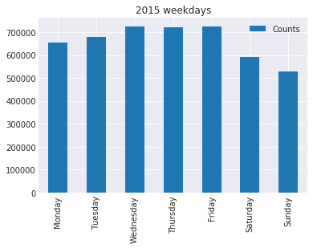
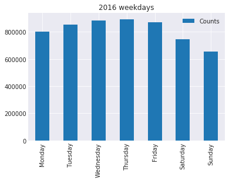

```python
import pandas as pd
import numpy as np
import warnings; warnings.simplefilter('ignore')
```


```python
d16 = pd.read_csv('2016_Call_a_bike_cleaned.csv')
d15 = pd.read_csv('2015_Call_a_bike_cleaned.csv')
```


```python
d15.index = d15['DATE_BOOKING']
del d15['DATE_BOOKING']

d16.index = d16['DATE_BOOKING']
del d16['DATE_BOOKING']

```


```python
d15.tail()
```


<div>
<style scoped>
    .dataframe tbody tr th:only-of-type {
        vertical-align: middle;
    }

    .dataframe tbody tr th {
        vertical-align: top;
    }

    .dataframe thead th {
        text-align: right;
    }
</style>
<table border="1" class="dataframe">
  <thead>
    <tr style="text-align: right;">
      <th></th>
      <th>CATEGORY_HAL_ID</th>
      <th>VEHICLE_HAL_ID</th>
      <th>DATE_BOOKING.1</th>
      <th>DATE_FROM</th>
      <th>DATE_UNTIL</th>
      <th>START_RENTAL_ZONE</th>
      <th>START_RENTAL_ZONE_HAL_ID</th>
      <th>END_RENTAL_ZONE</th>
      <th>END_RENTAL_ZONE_HAL_ID</th>
      <th>RENTAL_ZONE_HAL_SRC</th>
      <th>CITY_RENTAL_ZONE</th>
      <th>TECHNICAL_INCOME_CHANNEL</th>
    </tr>
    <tr>
      <th>DATE_BOOKING</th>
      <th></th>
      <th></th>
      <th></th>
      <th></th>
      <th></th>
      <th></th>
      <th></th>
      <th></th>
      <th></th>
      <th></th>
      <th></th>
      <th></th>
    </tr>
  </thead>
  <tbody>
    <tr>
      <th>2015-12-31 23:32:27</th>
      <td>51000</td>
      <td>116088</td>
      <td>2015-12-31 23:32:27</td>
      <td>2015-12-31 23:32:27</td>
      <td>2016-01-01 01:13:28</td>
      <td>Süderfeldstraße/Universitätsklinikum Eppendorf</td>
      <td>201328.0</td>
      <td>Eppendorfer Baum / Isestraße</td>
      <td>139508.0</td>
      <td>Standort</td>
      <td>Hamburg</td>
      <td>Techniker HH_19 (-2374-)</td>
    </tr>
    <tr>
      <th>2015-12-31 23:37:41</th>
      <td>51000</td>
      <td>120511</td>
      <td>2015-12-31 23:37:41</td>
      <td>2015-12-31 23:37:41</td>
      <td>2015-12-31 23:47:13</td>
      <td>Burgstraße/Hammer Landstraße</td>
      <td>131639.0</td>
      <td>Alsterschwimmhalle/Ifflandstraße</td>
      <td>198081.0</td>
      <td>Standort</td>
      <td>Hamburg</td>
      <td>Android SRH</td>
    </tr>
    <tr>
      <th>2015-12-31 21:05:42</th>
      <td>50000</td>
      <td>106690</td>
      <td>2015-12-31 21:05:42</td>
      <td>2015-12-31 21:05:42</td>
      <td>2015-12-31 21:08:17</td>
      <td>NaN</td>
      <td>23022.0</td>
      <td>NaN</td>
      <td>14392.0</td>
      <td>Standort</td>
      <td>München</td>
      <td>iPhone CAB</td>
    </tr>
    <tr>
      <th>2015-12-31 21:50:10</th>
      <td>50000</td>
      <td>106690</td>
      <td>2015-12-31 21:50:10</td>
      <td>2015-12-31 21:50:10</td>
      <td>2015-12-31 22:02:51</td>
      <td>NaN</td>
      <td>14392.0</td>
      <td>NaN</td>
      <td>22709.0</td>
      <td>Standort</td>
      <td>München</td>
      <td>iPhone CAB</td>
    </tr>
    <tr>
      <th>2015-12-31 22:08:26</th>
      <td>51000</td>
      <td>108021</td>
      <td>2015-12-31 22:08:26</td>
      <td>2015-12-31 22:08:26</td>
      <td>2015-12-31 22:33:32</td>
      <td>Siemersplatz/Kollaustraße</td>
      <td>252484.0</td>
      <td>Sternschanze / Eingang Dänenweg</td>
      <td>139501.0</td>
      <td>Standort</td>
      <td>Hamburg</td>
      <td>Techniker HH_221 (-2261-)</td>
    </tr>
  </tbody>
</table>
</div>


```python
d16.tail()
```


<div>
<style scoped>
    .dataframe tbody tr th:only-of-type {
        vertical-align: middle;
    }

    .dataframe tbody tr th {
        vertical-align: top;
    }

    .dataframe thead th {
        text-align: right;
    }
</style>
<table border="1" class="dataframe">
  <thead>
    <tr style="text-align: right;">
      <th></th>
      <th>CATEGORY_HAL_ID</th>
      <th>VEHICLE_HAL_ID</th>
      <th>DATE_BOOKING.1</th>
      <th>DATE_FROM</th>
      <th>DATE_UNTIL</th>
      <th>START_RENTAL_ZONE</th>
      <th>START_RENTAL_ZONE_HAL_ID</th>
      <th>END_RENTAL_ZONE</th>
      <th>END_RENTAL_ZONE_HAL_ID</th>
      <th>RENTAL_ZONE_HAL_SRC</th>
      <th>CITY_RENTAL_ZONE</th>
      <th>TECHNICAL_INCOME_CHANNEL</th>
    </tr>
    <tr>
      <th>DATE_BOOKING</th>
      <th></th>
      <th></th>
      <th></th>
      <th></th>
      <th></th>
      <th></th>
      <th></th>
      <th></th>
      <th></th>
      <th></th>
      <th></th>
      <th></th>
    </tr>
  </thead>
  <tbody>
    <tr>
      <th>2016-12-31 21:52:28</th>
      <td>51000</td>
      <td>117016</td>
      <td>2016-12-31 21:52:28</td>
      <td>2016-12-31 21:52:28</td>
      <td>2016-12-31 22:05:45</td>
      <td>Koppelstraße/Lokstedter Grenzstraße</td>
      <td>213792.0</td>
      <td>Isestraße / Hoheluftbrücke</td>
      <td>140804.0</td>
      <td>Standort</td>
      <td>Hamburg</td>
      <td>IVR</td>
    </tr>
    <tr>
      <th>2016-12-31 23:20:51</th>
      <td>51000</td>
      <td>120842</td>
      <td>2016-12-31 23:20:51</td>
      <td>2016-12-31 23:20:51</td>
      <td>2016-12-31 23:38:41</td>
      <td>Lappenbergsallee / Bei der Apostelkirche</td>
      <td>243618.0</td>
      <td>Allende-Platz/Grindelhof</td>
      <td>198077.0</td>
      <td>Standort</td>
      <td>Hamburg</td>
      <td>IVR</td>
    </tr>
    <tr>
      <th>2016-12-31 23:27:05</th>
      <td>51000</td>
      <td>108102</td>
      <td>2016-12-31 23:27:05</td>
      <td>2016-12-31 23:27:05</td>
      <td>2016-12-31 23:39:26</td>
      <td>Uferstraße/Wagnerstraße</td>
      <td>207619.0</td>
      <td>Eduard-Rhein-Ufer / Schwanenwik</td>
      <td>140800.0</td>
      <td>Standort</td>
      <td>Hamburg</td>
      <td>iPhone SRH</td>
    </tr>
    <tr>
      <th>2016-12-31 22:59:23</th>
      <td>51000</td>
      <td>119256</td>
      <td>2016-12-31 22:59:23</td>
      <td>2016-12-31 22:59:23</td>
      <td>2016-12-31 23:40:42</td>
      <td>Süderfeldstraße/Universitätsklinikum Eppendorf</td>
      <td>201328.0</td>
      <td>Thadenstraße/Holstenstraße</td>
      <td>252492.0</td>
      <td>Standort</td>
      <td>Hamburg</td>
      <td>NaN</td>
    </tr>
    <tr>
      <th>2016-12-31 23:54:05</th>
      <td>51000</td>
      <td>120518</td>
      <td>2016-12-31 23:54:05</td>
      <td>2016-12-31 23:54:05</td>
      <td>2017-01-01 00:05:28</td>
      <td>Reeseberg/EBV-Anzengruberstraße</td>
      <td>241777.0</td>
      <td>Harburger Rathausstraße/Deichhausweg</td>
      <td>242645.0</td>
      <td>Standort</td>
      <td>Hamburg</td>
      <td>Techniker HH_23 (-284-)</td>
    </tr>
  </tbody>
</table>
</div>


```python
d16.isnull().values.any()
```


    True


```python
d15.index = pd.to_datetime(d15.index)
d16.index = pd.to_datetime(d16.index)
```


```python
d15.index
```


    DatetimeIndex(['2015-01-01 00:14:25', '2015-01-01 00:26:09',
                   '2015-01-01 00:44:37', '2015-01-01 01:12:59',
                   '2015-01-01 01:27:20', '2015-01-01 01:31:38',
                   '2015-01-01 01:57:26', '2015-01-01 00:55:31',
                   '2015-01-01 01:25:55', '2015-01-01 02:42:09',
                   ...
                   '2015-12-31 20:39:33', '2015-12-31 21:57:14',
                   '2015-12-31 23:15:08', '2015-12-31 23:28:26',
                   '2015-12-31 22:40:18', '2015-12-31 23:32:27',
                   '2015-12-31 23:37:41', '2015-12-31 21:05:42',
                   '2015-12-31 21:50:10', '2015-12-31 22:08:26'],
                  dtype='datetime64[ns]', name='DATE_BOOKING', length=4624826, freq=None)


```python
d16.index
```


    DatetimeIndex(['2016-01-01 00:44:49', '2016-01-01 00:31:46',
                   '2016-01-01 00:38:37', '2016-01-01 01:11:00',
                   '2016-01-01 01:06:17', '2016-01-01 01:24:50',
                   '2016-01-01 00:08:54', '2016-01-01 00:27:53',
                   '2016-01-01 00:30:33', '2016-01-01 01:06:19',
                   ...
                   '2016-12-31 17:40:00', '2016-12-31 19:23:42',
                   '2016-12-31 20:02:58', '2016-12-31 20:09:58',
                   '2016-12-31 21:00:53', '2016-12-31 21:52:28',
                   '2016-12-31 23:20:51', '2016-12-31 23:27:05',
                   '2016-12-31 22:59:23', '2016-12-31 23:54:05'],
                  dtype='datetime64[ns]', name='DATE_BOOKING', length=5702575, freq=None)


```python
d15.insert(0, 'Trip_no', range(1, 1 + len(d15)))
d16.insert(0, 'Trip_no', range(1, 1 + len(d16)))
```


```python
d15.tail()
```


<div>
<style scoped>
    .dataframe tbody tr th:only-of-type {
        vertical-align: middle;
    }

    .dataframe tbody tr th {
        vertical-align: top;
    }

    .dataframe thead th {
        text-align: right;
    }
</style>
<table border="1" class="dataframe">
  <thead>
    <tr style="text-align: right;">
      <th></th>
      <th>Trip_no</th>
      <th>CATEGORY_HAL_ID</th>
      <th>VEHICLE_HAL_ID</th>
      <th>DATE_BOOKING.1</th>
      <th>DATE_FROM</th>
      <th>DATE_UNTIL</th>
      <th>START_RENTAL_ZONE</th>
      <th>START_RENTAL_ZONE_HAL_ID</th>
      <th>END_RENTAL_ZONE</th>
      <th>END_RENTAL_ZONE_HAL_ID</th>
      <th>RENTAL_ZONE_HAL_SRC</th>
      <th>CITY_RENTAL_ZONE</th>
      <th>TECHNICAL_INCOME_CHANNEL</th>
    </tr>
    <tr>
      <th>DATE_BOOKING</th>
      <th></th>
      <th></th>
      <th></th>
      <th></th>
      <th></th>
      <th></th>
      <th></th>
      <th></th>
      <th></th>
      <th></th>
      <th></th>
      <th></th>
      <th></th>
    </tr>
  </thead>
  <tbody>
    <tr>
      <th>2015-12-31 23:32:27</th>
      <td>4624822</td>
      <td>51000</td>
      <td>116088</td>
      <td>2015-12-31 23:32:27</td>
      <td>2015-12-31 23:32:27</td>
      <td>2016-01-01 01:13:28</td>
      <td>Süderfeldstraße/Universitätsklinikum Eppendorf</td>
      <td>201328.0</td>
      <td>Eppendorfer Baum / Isestraße</td>
      <td>139508.0</td>
      <td>Standort</td>
      <td>Hamburg</td>
      <td>Techniker HH_19 (-2374-)</td>
    </tr>
    <tr>
      <th>2015-12-31 23:37:41</th>
      <td>4624823</td>
      <td>51000</td>
      <td>120511</td>
      <td>2015-12-31 23:37:41</td>
      <td>2015-12-31 23:37:41</td>
      <td>2015-12-31 23:47:13</td>
      <td>Burgstraße/Hammer Landstraße</td>
      <td>131639.0</td>
      <td>Alsterschwimmhalle/Ifflandstraße</td>
      <td>198081.0</td>
      <td>Standort</td>
      <td>Hamburg</td>
      <td>Android SRH</td>
    </tr>
    <tr>
      <th>2015-12-31 21:05:42</th>
      <td>4624824</td>
      <td>50000</td>
      <td>106690</td>
      <td>2015-12-31 21:05:42</td>
      <td>2015-12-31 21:05:42</td>
      <td>2015-12-31 21:08:17</td>
      <td>NaN</td>
      <td>23022.0</td>
      <td>NaN</td>
      <td>14392.0</td>
      <td>Standort</td>
      <td>München</td>
      <td>iPhone CAB</td>
    </tr>
    <tr>
      <th>2015-12-31 21:50:10</th>
      <td>4624825</td>
      <td>50000</td>
      <td>106690</td>
      <td>2015-12-31 21:50:10</td>
      <td>2015-12-31 21:50:10</td>
      <td>2015-12-31 22:02:51</td>
      <td>NaN</td>
      <td>14392.0</td>
      <td>NaN</td>
      <td>22709.0</td>
      <td>Standort</td>
      <td>München</td>
      <td>iPhone CAB</td>
    </tr>
    <tr>
      <th>2015-12-31 22:08:26</th>
      <td>4624826</td>
      <td>51000</td>
      <td>108021</td>
      <td>2015-12-31 22:08:26</td>
      <td>2015-12-31 22:08:26</td>
      <td>2015-12-31 22:33:32</td>
      <td>Siemersplatz/Kollaustraße</td>
      <td>252484.0</td>
      <td>Sternschanze / Eingang Dänenweg</td>
      <td>139501.0</td>
      <td>Standort</td>
      <td>Hamburg</td>
      <td>Techniker HH_221 (-2261-)</td>
    </tr>
  </tbody>
</table>
</div>


```python
d16.tail()
```


<div>
<style scoped>
    .dataframe tbody tr th:only-of-type {
        vertical-align: middle;
    }

    .dataframe tbody tr th {
        vertical-align: top;
    }

    .dataframe thead th {
        text-align: right;
    }
</style>
<table border="1" class="dataframe">
  <thead>
    <tr style="text-align: right;">
      <th></th>
      <th>Trip_no</th>
      <th>CATEGORY_HAL_ID</th>
      <th>VEHICLE_HAL_ID</th>
      <th>DATE_BOOKING.1</th>
      <th>DATE_FROM</th>
      <th>DATE_UNTIL</th>
      <th>START_RENTAL_ZONE</th>
      <th>START_RENTAL_ZONE_HAL_ID</th>
      <th>END_RENTAL_ZONE</th>
      <th>END_RENTAL_ZONE_HAL_ID</th>
      <th>RENTAL_ZONE_HAL_SRC</th>
      <th>CITY_RENTAL_ZONE</th>
      <th>TECHNICAL_INCOME_CHANNEL</th>
    </tr>
    <tr>
      <th>DATE_BOOKING</th>
      <th></th>
      <th></th>
      <th></th>
      <th></th>
      <th></th>
      <th></th>
      <th></th>
      <th></th>
      <th></th>
      <th></th>
      <th></th>
      <th></th>
      <th></th>
    </tr>
  </thead>
  <tbody>
    <tr>
      <th>2016-12-31 21:52:28</th>
      <td>5702571</td>
      <td>51000</td>
      <td>117016</td>
      <td>2016-12-31 21:52:28</td>
      <td>2016-12-31 21:52:28</td>
      <td>2016-12-31 22:05:45</td>
      <td>Koppelstraße/Lokstedter Grenzstraße</td>
      <td>213792.0</td>
      <td>Isestraße / Hoheluftbrücke</td>
      <td>140804.0</td>
      <td>Standort</td>
      <td>Hamburg</td>
      <td>IVR</td>
    </tr>
    <tr>
      <th>2016-12-31 23:20:51</th>
      <td>5702572</td>
      <td>51000</td>
      <td>120842</td>
      <td>2016-12-31 23:20:51</td>
      <td>2016-12-31 23:20:51</td>
      <td>2016-12-31 23:38:41</td>
      <td>Lappenbergsallee / Bei der Apostelkirche</td>
      <td>243618.0</td>
      <td>Allende-Platz/Grindelhof</td>
      <td>198077.0</td>
      <td>Standort</td>
      <td>Hamburg</td>
      <td>IVR</td>
    </tr>
    <tr>
      <th>2016-12-31 23:27:05</th>
      <td>5702573</td>
      <td>51000</td>
      <td>108102</td>
      <td>2016-12-31 23:27:05</td>
      <td>2016-12-31 23:27:05</td>
      <td>2016-12-31 23:39:26</td>
      <td>Uferstraße/Wagnerstraße</td>
      <td>207619.0</td>
      <td>Eduard-Rhein-Ufer / Schwanenwik</td>
      <td>140800.0</td>
      <td>Standort</td>
      <td>Hamburg</td>
      <td>iPhone SRH</td>
    </tr>
    <tr>
      <th>2016-12-31 22:59:23</th>
      <td>5702574</td>
      <td>51000</td>
      <td>119256</td>
      <td>2016-12-31 22:59:23</td>
      <td>2016-12-31 22:59:23</td>
      <td>2016-12-31 23:40:42</td>
      <td>Süderfeldstraße/Universitätsklinikum Eppendorf</td>
      <td>201328.0</td>
      <td>Thadenstraße/Holstenstraße</td>
      <td>252492.0</td>
      <td>Standort</td>
      <td>Hamburg</td>
      <td>NaN</td>
    </tr>
    <tr>
      <th>2016-12-31 23:54:05</th>
      <td>5702575</td>
      <td>51000</td>
      <td>120518</td>
      <td>2016-12-31 23:54:05</td>
      <td>2016-12-31 23:54:05</td>
      <td>2017-01-01 00:05:28</td>
      <td>Reeseberg/EBV-Anzengruberstraße</td>
      <td>241777.0</td>
      <td>Harburger Rathausstraße/Deichhausweg</td>
      <td>242645.0</td>
      <td>Standort</td>
      <td>Hamburg</td>
      <td>Techniker HH_23 (-284-)</td>
    </tr>
  </tbody>
</table>
</div>


```python
d15.isnull().sum()
```


    Trip_no                          0
    CATEGORY_HAL_ID                  0
    VEHICLE_HAL_ID                   0
    DATE_BOOKING.1                   0
    DATE_FROM                        0
    DATE_UNTIL                       0
    START_RENTAL_ZONE           977057
    START_RENTAL_ZONE_HAL_ID    150945
    END_RENTAL_ZONE             984616
    END_RENTAL_ZONE_HAL_ID      152038
    RENTAL_ZONE_HAL_SRC          41123
    CITY_RENTAL_ZONE                 0
    TECHNICAL_INCOME_CHANNEL     65582
    dtype: int64


```python
d16.isnull().sum()
```


    Trip_no                           0
    CATEGORY_HAL_ID                   0
    VEHICLE_HAL_ID                    0
    DATE_BOOKING.1                    0
    DATE_FROM                         0
    DATE_UNTIL                        0
    START_RENTAL_ZONE           1162193
    START_RENTAL_ZONE_HAL_ID     279712
    END_RENTAL_ZONE             1173049
    END_RENTAL_ZONE_HAL_ID       282200
    RENTAL_ZONE_HAL_SRC          103756
    CITY_RENTAL_ZONE                  0
    TECHNICAL_INCOME_CHANNEL      63514
    dtype: int64


```python
d15 = d15.fillna(d15.bfill())
```


```python
d16 = d16.fillna(d16.bfill())
```


```python
d15.isnull().sum()
```


    Trip_no                     0
    CATEGORY_HAL_ID             0
    VEHICLE_HAL_ID              0
    DATE_BOOKING.1              0
    DATE_FROM                   0
    DATE_UNTIL                  0
    START_RENTAL_ZONE           0
    START_RENTAL_ZONE_HAL_ID    0
    END_RENTAL_ZONE             0
    END_RENTAL_ZONE_HAL_ID      0
    RENTAL_ZONE_HAL_SRC         0
    CITY_RENTAL_ZONE            0
    TECHNICAL_INCOME_CHANNEL    0
    dtype: int64


```python
d16.isnull().sum()
```


    Trip_no                     0
    CATEGORY_HAL_ID             0
    VEHICLE_HAL_ID              0
    DATE_BOOKING.1              0
    DATE_FROM                   0
    DATE_UNTIL                  0
    START_RENTAL_ZONE           0
    START_RENTAL_ZONE_HAL_ID    0
    END_RENTAL_ZONE             0
    END_RENTAL_ZONE_HAL_ID      0
    RENTAL_ZONE_HAL_SRC         0
    CITY_RENTAL_ZONE            0
    TECHNICAL_INCOME_CHANNEL    0
    dtype: int64


```python
# Analysing first 6 month of bike share

import matplotlib.pyplot as plt
%matplotlib inline
plt.subplot(121)
d15['Trip_no'].plot(figsize=(15, 6),label="2015",c='blue')
plt.subplot(122)
d16['Trip_no'].plot(label="2016",c='red')
#plt.legend()
plt.show()
```





```python
total_ride_2015 = len(d15) - 1 # without headers
print("Total ride in year 2015 : ", total_ride_2015)

total_ride_2016 = len(d16) - 1
print("Total ride in year 2016 : ", total_ride_2016)
#total_ride_2016_l = len(d16['2016-01-01':'2016-05-16'])
#print("Total ride in year 2016 (upto may 16): ", total_ride_2016_l)
#total_ride_2017 = len(d17)
#print("Total ride in year 2017 (upto may 16) : ",total_ride_2017)
```

    Total ride in year 2015 :  4624825
    Total ride in year 2016 :  5702574


```python
# 1 rental zone decrease in 2016
print(len(d15['CITY_RENTAL_ZONE'].unique()))
print(len(d16['CITY_RENTAL_ZONE'].unique()))
```

    47
    46


```python
# State rental zone increases

print(len(d15['START_RENTAL_ZONE'].unique()))
print(len(d16['START_RENTAL_ZONE'].unique()))
```

    717
    821


```python
d16['DATE_FROM'] = pd.to_datetime(d16['DATE_FROM']) 
d16['DATE_UNTIL'] = pd.to_datetime(d16['DATE_UNTIL'])

d15['DATE_FROM'] = pd.to_datetime(d15['DATE_FROM']) 
d15['DATE_UNTIL'] = pd.to_datetime(d15['DATE_UNTIL'])
```


```python
d15['Ride_Duration'] =  d15['DATE_UNTIL'] - d15['DATE_FROM'] 
d16['Ride_Duration'] =  d16['DATE_UNTIL'] - d16['DATE_FROM'] 
```


```python
d16['Ride_Duration'].describe()
```


    count                   5702575
    mean     0 days 00:30:18.344961
    std      0 days 12:04:10.139557
    min             0 days 00:00:01
    25%             0 days 00:07:03
    50%             0 days 00:11:53
    75%             0 days 00:19:56
    max           448 days 01:00:00
    Name: Ride_Duration, dtype: object


```python
d15['Ride_Duration'].describe()
```


    count                   4624826
    mean     0 days 00:30:22.280607
    std      0 days 08:55:34.362805
    min             0 days 00:00:01
    25%             0 days 00:07:01
    50%             0 days 00:11:46
    75%             0 days 00:19:45
    max           315 days 01:34:49
    Name: Ride_Duration, dtype: object


```python
d15.head()
```


<div>
<style scoped>
    .dataframe tbody tr th:only-of-type {
        vertical-align: middle;
    }

    .dataframe tbody tr th {
        vertical-align: top;
    }

    .dataframe thead th {
        text-align: right;
    }
</style>
<table border="1" class="dataframe">
  <thead>
    <tr style="text-align: right;">
      <th></th>
      <th>Trip_no</th>
      <th>CATEGORY_HAL_ID</th>
      <th>VEHICLE_HAL_ID</th>
      <th>DATE_BOOKING.1</th>
      <th>DATE_FROM</th>
      <th>DATE_UNTIL</th>
      <th>START_RENTAL_ZONE</th>
      <th>START_RENTAL_ZONE_HAL_ID</th>
      <th>END_RENTAL_ZONE</th>
      <th>END_RENTAL_ZONE_HAL_ID</th>
      <th>RENTAL_ZONE_HAL_SRC</th>
      <th>CITY_RENTAL_ZONE</th>
      <th>TECHNICAL_INCOME_CHANNEL</th>
      <th>Ride_Duration</th>
    </tr>
    <tr>
      <th>DATE_BOOKING</th>
      <th></th>
      <th></th>
      <th></th>
      <th></th>
      <th></th>
      <th></th>
      <th></th>
      <th></th>
      <th></th>
      <th></th>
      <th></th>
      <th></th>
      <th></th>
      <th></th>
    </tr>
  </thead>
  <tbody>
    <tr>
      <th>2015-01-01 00:14:25</th>
      <td>1</td>
      <td>51000</td>
      <td>119878</td>
      <td>2015-01-01 00:14:25</td>
      <td>2015-01-01 00:14:25</td>
      <td>2015-01-01 00:27:26</td>
      <td>Bahnhof Dammtor Süd / Marseiller Straße</td>
      <td>138382.0</td>
      <td>Osterstraße/Bismarckstraße</td>
      <td>131642.0</td>
      <td>Standort</td>
      <td>Hamburg</td>
      <td>Terminal HH_18 (-2528-)</td>
      <td>00:13:01</td>
    </tr>
    <tr>
      <th>2015-01-01 00:26:09</th>
      <td>2</td>
      <td>51000</td>
      <td>120624</td>
      <td>2015-01-01 00:26:09</td>
      <td>2015-01-01 00:26:09</td>
      <td>2015-01-01 00:43:51</td>
      <td>Eduard-Rhein-Ufer / Schwanenwik</td>
      <td>140800.0</td>
      <td>Burgstraße/Hammer Landstraße</td>
      <td>131639.0</td>
      <td>Standort</td>
      <td>Hamburg</td>
      <td>Terminal HH_31 (-2321-)</td>
      <td>00:17:42</td>
    </tr>
    <tr>
      <th>2015-01-01 00:44:37</th>
      <td>3</td>
      <td>51000</td>
      <td>120017</td>
      <td>2015-01-01 00:44:37</td>
      <td>2015-01-01 00:44:37</td>
      <td>2015-01-01 00:45:06</td>
      <td>Leinpfad/Fernsicht</td>
      <td>224650.0</td>
      <td>Leinpfad/Fernsicht</td>
      <td>224650.0</td>
      <td>Standort</td>
      <td>Hamburg</td>
      <td>Terminal HH_111 (-2316-)</td>
      <td>00:00:29</td>
    </tr>
    <tr>
      <th>2015-01-01 01:12:59</th>
      <td>4</td>
      <td>51000</td>
      <td>143629</td>
      <td>2015-01-01 01:12:59</td>
      <td>2015-01-01 01:12:59</td>
      <td>2015-01-01 01:43:09</td>
      <td>Osterstraße/Bismarckstraße</td>
      <td>131642.0</td>
      <td>Hudtwalckerstraße / Bebelallee</td>
      <td>138378.0</td>
      <td>Standort</td>
      <td>Hamburg</td>
      <td>Terminal HH_4 (-2612-)</td>
      <td>00:30:10</td>
    </tr>
    <tr>
      <th>2015-01-01 01:27:20</th>
      <td>5</td>
      <td>51000</td>
      <td>120391</td>
      <td>2015-01-01 01:27:20</td>
      <td>2015-01-01 01:27:20</td>
      <td>2015-01-01 01:32:32</td>
      <td>Millerntorplatz/St.Pauli</td>
      <td>131905.0</td>
      <td>Sievekingplatz/Gorch-Fock-Wall</td>
      <td>164033.0</td>
      <td>Standort</td>
      <td>Hamburg</td>
      <td>Terminal HH_4 (-2612-)</td>
      <td>00:05:12</td>
    </tr>
  </tbody>
</table>
</div>


```python
d15.groupby(d15.index.date).count().head()
```


<div>
<style scoped>
    .dataframe tbody tr th:only-of-type {
        vertical-align: middle;
    }

    .dataframe tbody tr th {
        vertical-align: top;
    }

    .dataframe thead th {
        text-align: right;
    }
</style>
<table border="1" class="dataframe">
  <thead>
    <tr style="text-align: right;">
      <th></th>
      <th>Trip_no</th>
      <th>CATEGORY_HAL_ID</th>
      <th>VEHICLE_HAL_ID</th>
      <th>DATE_BOOKING.1</th>
      <th>DATE_FROM</th>
      <th>DATE_UNTIL</th>
      <th>START_RENTAL_ZONE</th>
      <th>START_RENTAL_ZONE_HAL_ID</th>
      <th>END_RENTAL_ZONE</th>
      <th>END_RENTAL_ZONE_HAL_ID</th>
      <th>RENTAL_ZONE_HAL_SRC</th>
      <th>CITY_RENTAL_ZONE</th>
      <th>TECHNICAL_INCOME_CHANNEL</th>
      <th>Ride_Duration</th>
    </tr>
  </thead>
  <tbody>
    <tr>
      <th>2015-01-01</th>
      <td>3004</td>
      <td>3004</td>
      <td>3004</td>
      <td>3004</td>
      <td>3004</td>
      <td>3004</td>
      <td>3004</td>
      <td>3004</td>
      <td>3004</td>
      <td>3004</td>
      <td>3004</td>
      <td>3004</td>
      <td>3004</td>
      <td>3004</td>
    </tr>
    <tr>
      <th>2015-01-02</th>
      <td>3392</td>
      <td>3392</td>
      <td>3392</td>
      <td>3392</td>
      <td>3392</td>
      <td>3392</td>
      <td>3392</td>
      <td>3392</td>
      <td>3392</td>
      <td>3392</td>
      <td>3392</td>
      <td>3392</td>
      <td>3392</td>
      <td>3392</td>
    </tr>
    <tr>
      <th>2015-01-03</th>
      <td>2531</td>
      <td>2531</td>
      <td>2531</td>
      <td>2531</td>
      <td>2531</td>
      <td>2531</td>
      <td>2531</td>
      <td>2531</td>
      <td>2531</td>
      <td>2531</td>
      <td>2531</td>
      <td>2531</td>
      <td>2531</td>
      <td>2531</td>
    </tr>
    <tr>
      <th>2015-01-04</th>
      <td>4135</td>
      <td>4135</td>
      <td>4135</td>
      <td>4135</td>
      <td>4135</td>
      <td>4135</td>
      <td>4135</td>
      <td>4135</td>
      <td>4135</td>
      <td>4135</td>
      <td>4135</td>
      <td>4135</td>
      <td>4135</td>
      <td>4135</td>
    </tr>
    <tr>
      <th>2015-01-05</th>
      <td>6138</td>
      <td>6138</td>
      <td>6138</td>
      <td>6138</td>
      <td>6138</td>
      <td>6138</td>
      <td>6138</td>
      <td>6138</td>
      <td>6138</td>
      <td>6138</td>
      <td>6138</td>
      <td>6138</td>
      <td>6138</td>
      <td>6138</td>
    </tr>
  </tbody>
</table>
</div>


```python
from datetime import datetime
```


```python
dates = pd.date_range('2015-01-01','2015-12-31',freq='D')
date_count =  d15.groupby(d15.index.date).count()['Trip_no']
d15_day_count = pd.DataFrame(date_count)
d15_day_count = d15_day_count.rename(columns={"Trip_no": "Counts"})
d15_day_count.index.rename('date',inplace=True)
d15_day_count.tail()
```


<div>
<style scoped>
    .dataframe tbody tr th:only-of-type {
        vertical-align: middle;
    }

    .dataframe tbody tr th {
        vertical-align: top;
    }

    .dataframe thead th {
        text-align: right;
    }
</style>
<table border="1" class="dataframe">
  <thead>
    <tr style="text-align: right;">
      <th></th>
      <th>Counts</th>
    </tr>
    <tr>
      <th>date</th>
      <th></th>
    </tr>
  </thead>
  <tbody>
    <tr>
      <th>2015-12-27</th>
      <td>4488</td>
    </tr>
    <tr>
      <th>2015-12-28</th>
      <td>6851</td>
    </tr>
    <tr>
      <th>2015-12-29</th>
      <td>7231</td>
    </tr>
    <tr>
      <th>2015-12-30</th>
      <td>6819</td>
    </tr>
    <tr>
      <th>2015-12-31</th>
      <td>3857</td>
    </tr>
  </tbody>
</table>
</div>


```python
dates1 = pd.date_range('2016-01-01','2016-12-31',freq='D')
date_count1 =  d16.groupby(d16.index.date).count()['Trip_no']
d16_day_count = pd.DataFrame(date_count1)
d16_day_count = d16_day_count.rename(columns={"Trip_no": "Counts"})
d16_day_count.index.rename('date',inplace=True)
d16_day_count.tail()
```


<div>
<style scoped>
    .dataframe tbody tr th:only-of-type {
        vertical-align: middle;
    }

    .dataframe tbody tr th {
        vertical-align: top;
    }

    .dataframe thead th {
        text-align: right;
    }
</style>
<table border="1" class="dataframe">
  <thead>
    <tr style="text-align: right;">
      <th></th>
      <th>Counts</th>
    </tr>
    <tr>
      <th>date</th>
      <th></th>
    </tr>
  </thead>
  <tbody>
    <tr>
      <th>2016-12-27</th>
      <td>5413</td>
    </tr>
    <tr>
      <th>2016-12-28</th>
      <td>7454</td>
    </tr>
    <tr>
      <th>2016-12-29</th>
      <td>8029</td>
    </tr>
    <tr>
      <th>2016-12-30</th>
      <td>7002</td>
    </tr>
    <tr>
      <th>2016-12-31</th>
      <td>3892</td>
    </tr>
  </tbody>
</table>
</div>


```python
d15_day_count.describe()
```


<div>
<style scoped>
    .dataframe tbody tr th:only-of-type {
        vertical-align: middle;
    }

    .dataframe tbody tr th {
        vertical-align: top;
    }

    .dataframe thead th {
        text-align: right;
    }
</style>
<table border="1" class="dataframe">
  <thead>
    <tr style="text-align: right;">
      <th></th>
      <th>Counts</th>
    </tr>
  </thead>
  <tbody>
    <tr>
      <th>count</th>
      <td>365.000000</td>
    </tr>
    <tr>
      <th>mean</th>
      <td>12670.756164</td>
    </tr>
    <tr>
      <th>std</th>
      <td>5467.468064</td>
    </tr>
    <tr>
      <th>min</th>
      <td>2531.000000</td>
    </tr>
    <tr>
      <th>25%</th>
      <td>7620.000000</td>
    </tr>
    <tr>
      <th>50%</th>
      <td>12821.000000</td>
    </tr>
    <tr>
      <th>75%</th>
      <td>16863.000000</td>
    </tr>
    <tr>
      <th>max</th>
      <td>25564.000000</td>
    </tr>
  </tbody>
</table>
</div>


```python
d16_day_count.describe()
```


<div>
<style scoped>
    .dataframe tbody tr th:only-of-type {
        vertical-align: middle;
    }

    .dataframe tbody tr th {
        vertical-align: top;
    }

    .dataframe thead th {
        text-align: right;
    }
</style>
<table border="1" class="dataframe">
  <thead>
    <tr style="text-align: right;">
      <th></th>
      <th>Counts</th>
    </tr>
  </thead>
  <tbody>
    <tr>
      <th>count</th>
      <td>366.000000</td>
    </tr>
    <tr>
      <th>mean</th>
      <td>15580.806011</td>
    </tr>
    <tr>
      <th>std</th>
      <td>6576.738417</td>
    </tr>
    <tr>
      <th>min</th>
      <td>1540.000000</td>
    </tr>
    <tr>
      <th>25%</th>
      <td>10122.500000</td>
    </tr>
    <tr>
      <th>50%</th>
      <td>15110.500000</td>
    </tr>
    <tr>
      <th>75%</th>
      <td>21396.500000</td>
    </tr>
    <tr>
      <th>max</th>
      <td>28129.000000</td>
    </tr>
  </tbody>
</table>
</div>


```python
%matplotlib inline
```


```python
import seaborn as sns 
plt.figure(figsize=(20,12))
sns.set_style("darkgrid")
plt.plot(d15_day_count)
plt.xlabel('2015 Dates')
plt.ylabel('Total rides')
plt.show()
```





```python
import seaborn as sns 
plt.figure(figsize=(20,12))
sns.set_style("darkgrid")
plt.plot(d16_day_count)
plt.xlabel('2016 Dates')
plt.ylabel('Total rides')
plt.show()
```





```python
daterange1 = pd.date_range('2015-01-01','2015-12-31', freq='1M') 
daterange1 = [d.strftime('%b-%y') for d in daterange1]

month_count1 = d15.groupby(d15.index.month).count()['Trip_no']

d15_month_count = pd.DataFrame(month_count1)
d15_month_count = d15_month_count.rename(columns={"Trip_no": "Counts"})
d15_month_count.index.rename('2015_month',inplace=True)
d15_month_count['months 2015'] = daterange1
d15_month_count.set_index('months 2015',inplace=True)
d15_month_count
```


<div>
<style scoped>
    .dataframe tbody tr th:only-of-type {
        vertical-align: middle;
    }

    .dataframe tbody tr th {
        vertical-align: top;
    }

    .dataframe thead th {
        text-align: right;
    }
</style>
<table border="1" class="dataframe">
  <thead>
    <tr style="text-align: right;">
      <th></th>
      <th>Counts</th>
    </tr>
    <tr>
      <th>months 2015</th>
      <th></th>
    </tr>
  </thead>
  <tbody>
    <tr>
      <th>Jan-15</th>
      <td>162744</td>
    </tr>
    <tr>
      <th>Feb-15</th>
      <td>165429</td>
    </tr>
    <tr>
      <th>Mar-15</th>
      <td>245823</td>
    </tr>
    <tr>
      <th>Apr-15</th>
      <td>396467</td>
    </tr>
    <tr>
      <th>May-15</th>
      <td>479878</td>
    </tr>
    <tr>
      <th>Jun-15</th>
      <td>559966</td>
    </tr>
    <tr>
      <th>Jul-15</th>
      <td>585331</td>
    </tr>
    <tr>
      <th>Aug-15</th>
      <td>584580</td>
    </tr>
    <tr>
      <th>Sep-15</th>
      <td>433013</td>
    </tr>
    <tr>
      <th>Oct-15</th>
      <td>396569</td>
    </tr>
    <tr>
      <th>Nov-15</th>
      <td>332755</td>
    </tr>
    <tr>
      <th>Dec-15</th>
      <td>282271</td>
    </tr>
  </tbody>
</table>
</div>


```python
daterange = pd.date_range('2016-01-01','2016-12-31', freq='1M') 
daterange = [d.strftime('%b-%y') for d in daterange]

month_count = d16.groupby(d16.index.month).count()['Trip_no']

d16_month_count = pd.DataFrame(month_count)
d16_month_count = d16_month_count.rename(columns={"Trip_no": "Counts"})
d16_month_count.index.rename('2016_month',inplace=True)
d16_month_count['months 2016'] = daterange
d16_month_count.set_index('months 2016',inplace=True)
d16_month_count
```


<div>
<style scoped>
    .dataframe tbody tr th:only-of-type {
        vertical-align: middle;
    }

    .dataframe tbody tr th {
        vertical-align: top;
    }

    .dataframe thead th {
        text-align: right;
    }
</style>
<table border="1" class="dataframe">
  <thead>
    <tr style="text-align: right;">
      <th></th>
      <th>Counts</th>
    </tr>
    <tr>
      <th>months 2016</th>
      <th></th>
    </tr>
  </thead>
  <tbody>
    <tr>
      <th>Jan-16</th>
      <td>229704</td>
    </tr>
    <tr>
      <th>Feb-16</th>
      <td>262906</td>
    </tr>
    <tr>
      <th>Mar-16</th>
      <td>310640</td>
    </tr>
    <tr>
      <th>Apr-16</th>
      <td>495376</td>
    </tr>
    <tr>
      <th>May-16</th>
      <td>649252</td>
    </tr>
    <tr>
      <th>Jun-16</th>
      <td>671084</td>
    </tr>
    <tr>
      <th>Jul-16</th>
      <td>691377</td>
    </tr>
    <tr>
      <th>Aug-16</th>
      <td>670195</td>
    </tr>
    <tr>
      <th>Sep-16</th>
      <td>665214</td>
    </tr>
    <tr>
      <th>Oct-16</th>
      <td>451581</td>
    </tr>
    <tr>
      <th>Nov-16</th>
      <td>340488</td>
    </tr>
    <tr>
      <th>Dec-16</th>
      <td>264758</td>
    </tr>
  </tbody>
</table>
</div>


```python
#pd.to_datetime = d16_month_count.index
```


```python
d15_month_count.plot(kind="bar",title='month count 2015')
d16_month_count.plot(kind="bar",title='month count 2016')
```


    <matplotlib.axes._subplots.AxesSubplot at 0x7f3196521240>








```python

#d16_month_count.plot(use_index=True)
```


```python
d15_day_count.index = d15_day_count.index.to_datetime()
d16_day_count.index = d16_day_count.index.to_datetime()
```


```python
weekday_counts  = d15_day_count.groupby(d15_day_count.index.weekday).aggregate(sum)
weekday_counts1 = d16_day_count.groupby(d16_day_count.index.weekday).aggregate(sum)
```


```python
weekday_counts
```


<div>
<style scoped>
    .dataframe tbody tr th:only-of-type {
        vertical-align: middle;
    }

    .dataframe tbody tr th {
        vertical-align: top;
    }

    .dataframe thead th {
        text-align: right;
    }
</style>
<table border="1" class="dataframe">
  <thead>
    <tr style="text-align: right;">
      <th></th>
      <th>Counts</th>
    </tr>
  </thead>
  <tbody>
    <tr>
      <th>0</th>
      <td>655606</td>
    </tr>
    <tr>
      <th>1</th>
      <td>678497</td>
    </tr>
    <tr>
      <th>2</th>
      <td>725721</td>
    </tr>
    <tr>
      <th>3</th>
      <td>719699</td>
    </tr>
    <tr>
      <th>4</th>
      <td>724610</td>
    </tr>
    <tr>
      <th>5</th>
      <td>590571</td>
    </tr>
    <tr>
      <th>6</th>
      <td>530122</td>
    </tr>
  </tbody>
</table>
</div>


```python
weekday_counts1
```


<div>
<style scoped>
    .dataframe tbody tr th:only-of-type {
        vertical-align: middle;
    }

    .dataframe tbody tr th {
        vertical-align: top;
    }

    .dataframe thead th {
        text-align: right;
    }
</style>
<table border="1" class="dataframe">
  <thead>
    <tr style="text-align: right;">
      <th></th>
      <th>Counts</th>
    </tr>
  </thead>
  <tbody>
    <tr>
      <th>0</th>
      <td>802348</td>
    </tr>
    <tr>
      <th>1</th>
      <td>854152</td>
    </tr>
    <tr>
      <th>2</th>
      <td>881906</td>
    </tr>
    <tr>
      <th>3</th>
      <td>893502</td>
    </tr>
    <tr>
      <th>4</th>
      <td>872586</td>
    </tr>
    <tr>
      <th>5</th>
      <td>744513</td>
    </tr>
    <tr>
      <th>6</th>
      <td>653568</td>
    </tr>
  </tbody>
</table>
</div>


```python
weekday_counts.index = ['Monday', 'Tuesday', 'Wednesday', 'Thursday', 'Friday', 'Saturday', 'Sunday']
weekday_counts
```


<div>
<style scoped>
    .dataframe tbody tr th:only-of-type {
        vertical-align: middle;
    }

    .dataframe tbody tr th {
        vertical-align: top;
    }

    .dataframe thead th {
        text-align: right;
    }
</style>
<table border="1" class="dataframe">
  <thead>
    <tr style="text-align: right;">
      <th></th>
      <th>Counts</th>
    </tr>
  </thead>
  <tbody>
    <tr>
      <th>Monday</th>
      <td>655606</td>
    </tr>
    <tr>
      <th>Tuesday</th>
      <td>678497</td>
    </tr>
    <tr>
      <th>Wednesday</th>
      <td>725721</td>
    </tr>
    <tr>
      <th>Thursday</th>
      <td>719699</td>
    </tr>
    <tr>
      <th>Friday</th>
      <td>724610</td>
    </tr>
    <tr>
      <th>Saturday</th>
      <td>590571</td>
    </tr>
    <tr>
      <th>Sunday</th>
      <td>530122</td>
    </tr>
  </tbody>
</table>
</div>


```python
weekday_counts1.index = ['Monday', 'Tuesday', 'Wednesday', 'Thursday', 'Friday', 'Saturday', 'Sunday']
weekday_counts1
```


<div>
<style scoped>
    .dataframe tbody tr th:only-of-type {
        vertical-align: middle;
    }

    .dataframe tbody tr th {
        vertical-align: top;
    }

    .dataframe thead th {
        text-align: right;
    }
</style>
<table border="1" class="dataframe">
  <thead>
    <tr style="text-align: right;">
      <th></th>
      <th>Counts</th>
    </tr>
  </thead>
  <tbody>
    <tr>
      <th>Monday</th>
      <td>802348</td>
    </tr>
    <tr>
      <th>Tuesday</th>
      <td>854152</td>
    </tr>
    <tr>
      <th>Wednesday</th>
      <td>881906</td>
    </tr>
    <tr>
      <th>Thursday</th>
      <td>893502</td>
    </tr>
    <tr>
      <th>Friday</th>
      <td>872586</td>
    </tr>
    <tr>
      <th>Saturday</th>
      <td>744513</td>
    </tr>
    <tr>
      <th>Sunday</th>
      <td>653568</td>
    </tr>
  </tbody>
</table>
</div>


```python
weekday_counts.plot(kind='bar',title='2015 weekdays')
weekday_counts1.plot(kind='bar',title='2016 weekdays')
```


    <matplotlib.axes._subplots.AxesSubplot at 0x7f3196660a58>








```python
d15.head()
```


<div>
<style scoped>
    .dataframe tbody tr th:only-of-type {
        vertical-align: middle;
    }

    .dataframe tbody tr th {
        vertical-align: top;
    }

    .dataframe thead th {
        text-align: right;
    }
</style>
<table border="1" class="dataframe">
  <thead>
    <tr style="text-align: right;">
      <th></th>
      <th>Trip_no</th>
      <th>CATEGORY_HAL_ID</th>
      <th>VEHICLE_HAL_ID</th>
      <th>DATE_BOOKING.1</th>
      <th>DATE_FROM</th>
      <th>DATE_UNTIL</th>
      <th>START_RENTAL_ZONE</th>
      <th>START_RENTAL_ZONE_HAL_ID</th>
      <th>END_RENTAL_ZONE</th>
      <th>END_RENTAL_ZONE_HAL_ID</th>
      <th>RENTAL_ZONE_HAL_SRC</th>
      <th>CITY_RENTAL_ZONE</th>
      <th>TECHNICAL_INCOME_CHANNEL</th>
      <th>Ride_Duration</th>
    </tr>
    <tr>
      <th>DATE_BOOKING</th>
      <th></th>
      <th></th>
      <th></th>
      <th></th>
      <th></th>
      <th></th>
      <th></th>
      <th></th>
      <th></th>
      <th></th>
      <th></th>
      <th></th>
      <th></th>
      <th></th>
    </tr>
  </thead>
  <tbody>
    <tr>
      <th>2015-01-01 00:14:25</th>
      <td>1</td>
      <td>51000</td>
      <td>119878</td>
      <td>2015-01-01 00:14:25</td>
      <td>2015-01-01 00:14:25</td>
      <td>2015-01-01 00:27:26</td>
      <td>Bahnhof Dammtor Süd / Marseiller Straße</td>
      <td>138382.0</td>
      <td>Osterstraße/Bismarckstraße</td>
      <td>131642.0</td>
      <td>Standort</td>
      <td>Hamburg</td>
      <td>Terminal HH_18 (-2528-)</td>
      <td>00:13:01</td>
    </tr>
    <tr>
      <th>2015-01-01 00:26:09</th>
      <td>2</td>
      <td>51000</td>
      <td>120624</td>
      <td>2015-01-01 00:26:09</td>
      <td>2015-01-01 00:26:09</td>
      <td>2015-01-01 00:43:51</td>
      <td>Eduard-Rhein-Ufer / Schwanenwik</td>
      <td>140800.0</td>
      <td>Burgstraße/Hammer Landstraße</td>
      <td>131639.0</td>
      <td>Standort</td>
      <td>Hamburg</td>
      <td>Terminal HH_31 (-2321-)</td>
      <td>00:17:42</td>
    </tr>
    <tr>
      <th>2015-01-01 00:44:37</th>
      <td>3</td>
      <td>51000</td>
      <td>120017</td>
      <td>2015-01-01 00:44:37</td>
      <td>2015-01-01 00:44:37</td>
      <td>2015-01-01 00:45:06</td>
      <td>Leinpfad/Fernsicht</td>
      <td>224650.0</td>
      <td>Leinpfad/Fernsicht</td>
      <td>224650.0</td>
      <td>Standort</td>
      <td>Hamburg</td>
      <td>Terminal HH_111 (-2316-)</td>
      <td>00:00:29</td>
    </tr>
    <tr>
      <th>2015-01-01 01:12:59</th>
      <td>4</td>
      <td>51000</td>
      <td>143629</td>
      <td>2015-01-01 01:12:59</td>
      <td>2015-01-01 01:12:59</td>
      <td>2015-01-01 01:43:09</td>
      <td>Osterstraße/Bismarckstraße</td>
      <td>131642.0</td>
      <td>Hudtwalckerstraße / Bebelallee</td>
      <td>138378.0</td>
      <td>Standort</td>
      <td>Hamburg</td>
      <td>Terminal HH_4 (-2612-)</td>
      <td>00:30:10</td>
    </tr>
    <tr>
      <th>2015-01-01 01:27:20</th>
      <td>5</td>
      <td>51000</td>
      <td>120391</td>
      <td>2015-01-01 01:27:20</td>
      <td>2015-01-01 01:27:20</td>
      <td>2015-01-01 01:32:32</td>
      <td>Millerntorplatz/St.Pauli</td>
      <td>131905.0</td>
      <td>Sievekingplatz/Gorch-Fock-Wall</td>
      <td>164033.0</td>
      <td>Standort</td>
      <td>Hamburg</td>
      <td>Terminal HH_4 (-2612-)</td>
      <td>00:05:12</td>
    </tr>
  </tbody>
</table>
</div>


```python
len(d15['CITY_RENTAL_ZONE'].unique())
```


    47


```python
df_2015_test = d15.copy()
```


```python
df_2015_test.head()
```


<div>
<style scoped>
    .dataframe tbody tr th:only-of-type {
        vertical-align: middle;
    }

    .dataframe tbody tr th {
        vertical-align: top;
    }

    .dataframe thead th {
        text-align: right;
    }
</style>
<table border="1" class="dataframe">
  <thead>
    <tr style="text-align: right;">
      <th></th>
      <th>Trip_no</th>
      <th>CATEGORY_HAL_ID</th>
      <th>VEHICLE_HAL_ID</th>
      <th>DATE_BOOKING.1</th>
      <th>DATE_FROM</th>
      <th>DATE_UNTIL</th>
      <th>START_RENTAL_ZONE</th>
      <th>START_RENTAL_ZONE_HAL_ID</th>
      <th>END_RENTAL_ZONE</th>
      <th>END_RENTAL_ZONE_HAL_ID</th>
      <th>RENTAL_ZONE_HAL_SRC</th>
      <th>CITY_RENTAL_ZONE</th>
      <th>TECHNICAL_INCOME_CHANNEL</th>
      <th>Ride_Duration</th>
    </tr>
    <tr>
      <th>DATE_BOOKING</th>
      <th></th>
      <th></th>
      <th></th>
      <th></th>
      <th></th>
      <th></th>
      <th></th>
      <th></th>
      <th></th>
      <th></th>
      <th></th>
      <th></th>
      <th></th>
      <th></th>
    </tr>
  </thead>
  <tbody>
    <tr>
      <th>2015-01-01 00:14:25</th>
      <td>1</td>
      <td>51000</td>
      <td>119878</td>
      <td>2015-01-01 00:14:25</td>
      <td>2015-01-01 00:14:25</td>
      <td>2015-01-01 00:27:26</td>
      <td>Bahnhof Dammtor Süd / Marseiller Straße</td>
      <td>138382.0</td>
      <td>Osterstraße/Bismarckstraße</td>
      <td>131642.0</td>
      <td>Standort</td>
      <td>Hamburg</td>
      <td>Terminal HH_18 (-2528-)</td>
      <td>00:13:01</td>
    </tr>
    <tr>
      <th>2015-01-01 00:26:09</th>
      <td>2</td>
      <td>51000</td>
      <td>120624</td>
      <td>2015-01-01 00:26:09</td>
      <td>2015-01-01 00:26:09</td>
      <td>2015-01-01 00:43:51</td>
      <td>Eduard-Rhein-Ufer / Schwanenwik</td>
      <td>140800.0</td>
      <td>Burgstraße/Hammer Landstraße</td>
      <td>131639.0</td>
      <td>Standort</td>
      <td>Hamburg</td>
      <td>Terminal HH_31 (-2321-)</td>
      <td>00:17:42</td>
    </tr>
    <tr>
      <th>2015-01-01 00:44:37</th>
      <td>3</td>
      <td>51000</td>
      <td>120017</td>
      <td>2015-01-01 00:44:37</td>
      <td>2015-01-01 00:44:37</td>
      <td>2015-01-01 00:45:06</td>
      <td>Leinpfad/Fernsicht</td>
      <td>224650.0</td>
      <td>Leinpfad/Fernsicht</td>
      <td>224650.0</td>
      <td>Standort</td>
      <td>Hamburg</td>
      <td>Terminal HH_111 (-2316-)</td>
      <td>00:00:29</td>
    </tr>
    <tr>
      <th>2015-01-01 01:12:59</th>
      <td>4</td>
      <td>51000</td>
      <td>143629</td>
      <td>2015-01-01 01:12:59</td>
      <td>2015-01-01 01:12:59</td>
      <td>2015-01-01 01:43:09</td>
      <td>Osterstraße/Bismarckstraße</td>
      <td>131642.0</td>
      <td>Hudtwalckerstraße / Bebelallee</td>
      <td>138378.0</td>
      <td>Standort</td>
      <td>Hamburg</td>
      <td>Terminal HH_4 (-2612-)</td>
      <td>00:30:10</td>
    </tr>
    <tr>
      <th>2015-01-01 01:27:20</th>
      <td>5</td>
      <td>51000</td>
      <td>120391</td>
      <td>2015-01-01 01:27:20</td>
      <td>2015-01-01 01:27:20</td>
      <td>2015-01-01 01:32:32</td>
      <td>Millerntorplatz/St.Pauli</td>
      <td>131905.0</td>
      <td>Sievekingplatz/Gorch-Fock-Wall</td>
      <td>164033.0</td>
      <td>Standort</td>
      <td>Hamburg</td>
      <td>Terminal HH_4 (-2612-)</td>
      <td>00:05:12</td>
    </tr>
  </tbody>
</table>
</div>


```python
del df_2015_test['RENTAL_ZONE_HAL_SRC']
```


```python
df_2015_test.info()

```

    <class 'pandas.core.frame.DataFrame'>
    DatetimeIndex: 4624826 entries, 2015-01-01 00:14:25 to 2015-12-31 22:08:26
    Data columns (total 13 columns):
    Trip_no                     int64
    CATEGORY_HAL_ID             int64
    VEHICLE_HAL_ID              int64
    DATE_BOOKING.1              object
    DATE_FROM                   datetime64[ns]
    DATE_UNTIL                  datetime64[ns]
    START_RENTAL_ZONE           object
    START_RENTAL_ZONE_HAL_ID    float64
    END_RENTAL_ZONE             object
    END_RENTAL_ZONE_HAL_ID      float64
    CITY_RENTAL_ZONE            object
    TECHNICAL_INCOME_CHANNEL    object
    Ride_Duration               timedelta64[ns]
    dtypes: datetime64[ns](2), float64(2), int64(3), object(5), timedelta64[ns](1)
    memory usage: 494.0+ MB


```python
df_2015_test['2015-01-01':'2015-03-31'].to_csv('2015_Call_a_bike_cleaned_test.csv', sep=',', encoding='utf-8')
```


```python
df_2015_test['2015-01-01':'2015-03-31'].info()
```

    <class 'pandas.core.frame.DataFrame'>
    DatetimeIndex: 573996 entries, 2015-01-01 00:14:25 to 2015-03-31 22:24:30
    Data columns (total 13 columns):
    Trip_no                     573996 non-null int64
    CATEGORY_HAL_ID             573996 non-null int64
    VEHICLE_HAL_ID              573996 non-null int64
    DATE_BOOKING.1              573996 non-null object
    DATE_FROM                   573996 non-null datetime64[ns]
    DATE_UNTIL                  573996 non-null datetime64[ns]
    START_RENTAL_ZONE           573996 non-null object
    START_RENTAL_ZONE_HAL_ID    573996 non-null float64
    END_RENTAL_ZONE             573996 non-null object
    END_RENTAL_ZONE_HAL_ID      573996 non-null float64
    CITY_RENTAL_ZONE            573996 non-null object
    TECHNICAL_INCOME_CHANNEL    573996 non-null object
    Ride_Duration               573996 non-null timedelta64[ns]
    dtypes: datetime64[ns](2), float64(2), int64(3), object(5), timedelta64[ns](1)
    memory usage: 61.3+ MB


```python
!ls
```

    2015_Call_a_bike.csv		   OPENDATA_BOOKING_CALL_A_BIKE.csv
    2015_Call_a_bike_cleaned.csv	   OPENDATA_CATEGORY_CALL_A_BIKE.csv
    2015_Call_a_bike_cleaned_test.csv  OPENDATA_RENTAL_ZONE_CALL_A_BIKE.csv
    2016_Call_a_bike.csv		   OPENDATA_VEHICLE_CALL_A_BIKE.csv
    2016_Call_a_bike_cleaned.csv	   Population.xlsx
    2017_Call_a_bike.csv		   Rental_zone.ipynb
    2017_Call_a_bike_cleaned.csv	   Untitled.ipynb
    Call_a_bike_Relation.ipynb	   Untitled1.ipynb
    Data_Analysis_2015.ipynb	   Vehicle.ipynb
    Data_Analysis_2016.ipynb	   data.sh
    Data_Analysis_2017.ipynb	   gdrive
    Data_preprocessing.ipynb	   utils.py


```python
population = pd.read_excel('Population.xlsx',index_col='States')
population.head()
```


<div>
<style scoped>
    .dataframe tbody tr th:only-of-type {
        vertical-align: middle;
    }

    .dataframe tbody tr th {
        vertical-align: top;
    }

    .dataframe thead th {
        text-align: right;
    }
</style>
<table border="1" class="dataframe">
  <thead>
    <tr style="text-align: right;">
      <th></th>
      <th>2008</th>
      <th>2009</th>
      <th>2010</th>
      <th>2011</th>
      <th>2012</th>
      <th>2013</th>
      <th>2014</th>
      <th>2015</th>
      <th>2016</th>
    </tr>
    <tr>
      <th>States</th>
      <th></th>
      <th></th>
      <th></th>
      <th></th>
      <th></th>
      <th></th>
      <th></th>
      <th></th>
      <th></th>
    </tr>
  </thead>
  <tbody>
    <tr>
      <th>Berlin</th>
      <td>3431.7</td>
      <td>3442.7</td>
      <td>3460.7</td>
      <td>35,10,872</td>
      <td>33,75,222</td>
      <td>34,21,829</td>
      <td>34,69,849</td>
      <td>35,20,031</td>
      <td>35,74,830</td>
    </tr>
    <tr>
      <th>Hamburg</th>
      <td>1772.1</td>
      <td>1774.2</td>
      <td>1786.4</td>
      <td>17,98,836</td>
      <td>17,34,272</td>
      <td>17,46,342</td>
      <td>17,62,791</td>
      <td>17,87,408</td>
      <td>18,10,438</td>
    </tr>
    <tr>
      <th>München</th>
      <td>1326.8</td>
      <td>1330.4</td>
      <td>1353.2</td>
      <td>13,78,176</td>
      <td>13,88,308</td>
      <td>14,07,836</td>
      <td>14,29,584</td>
      <td>14,50,381</td>
      <td>14,64,301</td>
    </tr>
    <tr>
      <th>Köln</th>
      <td>995.4</td>
      <td>998.1</td>
      <td>1007.1</td>
      <td>10,17,155</td>
      <td>10,24,373</td>
      <td>10,34,175</td>
      <td>10,46,680</td>
      <td>10,60,582</td>
      <td>10,75,935</td>
    </tr>
    <tr>
      <th>Frankfurt am Main</th>
      <td>664.8</td>
      <td>671.9</td>
      <td>679.7</td>
      <td>6,91,518</td>
      <td>6,87,775</td>
      <td>7,01,350</td>
      <td>7,17,624</td>
      <td>7,32,688</td>
      <td>7,36,414</td>
    </tr>
  </tbody>
</table>
</div>


```python
population[2016]['Berlin']
```


    '35,74,830'


```python
orig_state = d15['CITY_RENTAL_ZONE'].unique()
orig_state  = set(orig_state)
orig_state
```


    {'Aschaffenburg',
     'Baden-Baden',
     'Bamberg',
     'Berlin',
     'Bielefeld',
     'Bonn',
     'Braunschweig',
     'Bremen',
     'Darmstadt',
     'Düsseldorf',
     'Erlangen',
     'Flugh. Frankfurt',
     'Frankfurt am Main',
     'Freiburg',
     'Fulda',
     'Göttingen',
     'Gütersloh',
     'Halle',
     'Hamburg',
     'Hanau',
     'Hannover',
     'Heidelberg',
     'Hennef',
     'Ingolstadt',
     'Kaiserslautern',
     'Karlsruhe',
     'Kassel',
     'Kiel',
     'Köln',
     'Lübeck',
     'Magdeburg',
     'Mainz',
     'Mannheim',
     'Marburg',
     'München',
     'Oberhausen',
     'Oldenburg (Oldb)',
     'Rostock',
     'Rüsselsheim',
     'Saarbrücken',
     'Stuttgart',
     'Troisdorf',
     'Warnemünde',
     'Weimar',
     'Wiesbaden',
     'Wolfsburg',
     'Würzburg'}


```python
state = population['States'].unique()
state = set(state)
state
```


    {'Aachen*',
     'Augsburg',
     'Bergisch Gladbach*',
     'Berlin',
     'Bielefeld',
     'Bochum',
     'Bonn',
     'Bottrop',
     'Braunschweig',
     'Bremen',
     'Bremerhaven',
     'Chemnitz',
     'Cottbus',
     'Darmstadt',
     'Dortmund',
     'Dresden',
     'Duisburg',
     'Düsseldorf',
     'Erfurt',
     'Erlangen',
     'Essen',
     'Frankfurt am Main',
     'Freiburg im Breisgau',
     'Fürth',
     'Gelsenkirchen',
     'Göttingen*',
     'Hagen',
     'Halle (Saale)',
     'Hamburg',
     'Hamm',
     'Hannover*',
     'Heidelberg',
     'Heilbronn',
     'Herne',
     'Hildesheim*',
     'Ingolstadt',
     'Jena',
     'Karlsruhe',
     'Kassel',
     'Kiel',
     'Koblenz',
     'Krefeld',
     'Köln',
     'Leipzig',
     'Leverkusen',
     'Ludwigshafen am Rhein',
     'Lübeck',
     'Magdeburg',
     'Mainz',
     'Mannheim',
     'Moers*',
     'Mönchengladbach',
     'Mülheim a. d. Ruhr',
     'München',
     'Münster',
     'Neuss*',
     'Nürnberg',
     'Oberhausen',
     'Offenbach am Main',
     'Oldenburg',
     'Osnabrück',
     'Paderborn*',
     'Pforzheim',
     'Potsdam',
     'Recklinghausen*',
     'Regensburg',
     'Remscheid',
     'Reutlingen*',
     'Rostock',
     'Saarbrücken*',
     'Salzgitter',
     'Siegen*',
     'Solingen',
     'Stuttgart',
     'Trier',
     'Ulm',
     'Wiesbaden',
     'Wolfsburg',
     'Wuppertal',
     'Würzburg'}


```python
he = (orig_state & state)
orig_state.difference(he)
```


    {'Aschaffenburg',
     'Baden-Baden',
     'Bamberg',
     'Flugh. Frankfurt',
     'Freiburg',
     'Fulda',
     'Göttingen',
     'Gütersloh',
     'Halle',
     'Hanau',
     'Hannover',
     'Hennef',
     'Kaiserslautern',
     'Marburg',
     'Oldenburg (Oldb)',
     'Rüsselsheim',
     'Saarbrücken',
     'Troisdorf',
     'Warnemünde',
     'Weimar'}


```python
state.difference(he)
```


    {'Aachen*',
     'Augsburg',
     'Bergisch Gladbach*',
     'Bochum',
     'Bottrop',
     'Bremerhaven',
     'Chemnitz',
     'Cottbus',
     'Dortmund',
     'Dresden',
     'Duisburg',
     'Erfurt',
     'Essen',
     'Freiburg im Breisgau',
     'Fürth',
     'Gelsenkirchen',
     'Göttingen*',
     'Hagen',
     'Halle (Saale)',
     'Hamm',
     'Hannover*',
     'Heilbronn',
     'Herne',
     'Hildesheim*',
     'Jena',
     'Koblenz',
     'Krefeld',
     'Leipzig',
     'Leverkusen',
     'Ludwigshafen am Rhein',
     'Moers*',
     'Mönchengladbach',
     'Mülheim a. d. Ruhr',
     'Münster',
     'Neuss*',
     'Nürnberg',
     'Offenbach am Main',
     'Oldenburg',
     'Osnabrück',
     'Paderborn*',
     'Pforzheim',
     'Potsdam',
     'Recklinghausen*',
     'Regensburg',
     'Remscheid',
     'Reutlingen*',
     'Saarbrücken*',
     'Salzgitter',
     'Siegen*',
     'Solingen',
     'Trier',
     'Ulm',
     'Wuppertal'}


```python
len(orig_state)
```


    47


```python
len(orig_state & state)
```


    27


```python
states_15 = d15['CITY_RENTAL_ZONE'].unique() 
states_16 = d16['CITY_RENTAL_ZONE'].unique() 
```


```python
state15_call_count = {}
for city in states_15:
    state15_call_count[city] = len(d15[d15['CITY_RENTAL_ZONE']==city])
state15_call_count_df = pd.Series(state15_call_count)
state15_call_count_df = pd.DataFrame(state15_call_count_df)
state15_call_count_df.rename(columns={0:'No_Bookings'}, inplace=True)
state15_call_count_df.index.names = ['State']
state15_call_count_df.head()
```


<div>
<style scoped>
    .dataframe tbody tr th:only-of-type {
        vertical-align: middle;
    }

    .dataframe tbody tr th {
        vertical-align: top;
    }

    .dataframe thead th {
        text-align: right;
    }
</style>
<table border="1" class="dataframe">
  <thead>
    <tr style="text-align: right;">
      <th></th>
      <th>No_Bookings</th>
    </tr>
    <tr>
      <th>State</th>
      <th></th>
    </tr>
  </thead>
  <tbody>
    <tr>
      <th>Aschaffenburg</th>
      <td>48</td>
    </tr>
    <tr>
      <th>Baden-Baden</th>
      <td>845</td>
    </tr>
    <tr>
      <th>Bamberg</th>
      <td>55</td>
    </tr>
    <tr>
      <th>Berlin</th>
      <td>358854</td>
    </tr>
    <tr>
      <th>Bielefeld</th>
      <td>62</td>
    </tr>
  </tbody>
</table>
</div>


```python
state16_call_count = {}
for city in states_16:
    state16_call_count[city] = len(d16[d16['CITY_RENTAL_ZONE']==city])
state16_call_count_df = pd.Series(state16_call_count)
state16_call_count_df = pd.DataFrame(state16_call_count_df)
state16_call_count_df.rename(columns={0:'No_Bookings'}, inplace=True)
state16_call_count_df.index.names = ['State']
state16_call_count_df.head()
```


<div>
<style scoped>
    .dataframe tbody tr th:only-of-type {
        vertical-align: middle;
    }

    .dataframe tbody tr th {
        vertical-align: top;
    }

    .dataframe thead th {
        text-align: right;
    }
</style>
<table border="1" class="dataframe">
  <thead>
    <tr style="text-align: right;">
      <th></th>
      <th>No_Bookings</th>
    </tr>
    <tr>
      <th>State</th>
      <th></th>
    </tr>
  </thead>
  <tbody>
    <tr>
      <th>Aschaffenburg</th>
      <td>67</td>
    </tr>
    <tr>
      <th>Baden-Baden</th>
      <td>821</td>
    </tr>
    <tr>
      <th>Bamberg</th>
      <td>104</td>
    </tr>
    <tr>
      <th>Berlin</th>
      <td>334049</td>
    </tr>
    <tr>
      <th>Bielefeld</th>
      <td>41</td>
    </tr>
  </tbody>
</table>
</div>


```python
population.head()
```


<div>
<style scoped>
    .dataframe tbody tr th:only-of-type {
        vertical-align: middle;
    }

    .dataframe tbody tr th {
        vertical-align: top;
    }

    .dataframe thead th {
        text-align: right;
    }
</style>
<table border="1" class="dataframe">
  <thead>
    <tr style="text-align: right;">
      <th></th>
      <th>2008</th>
      <th>2009</th>
      <th>2010</th>
      <th>2011</th>
      <th>2012</th>
      <th>2013</th>
      <th>2014</th>
      <th>2015</th>
      <th>2016</th>
    </tr>
    <tr>
      <th>States</th>
      <th></th>
      <th></th>
      <th></th>
      <th></th>
      <th></th>
      <th></th>
      <th></th>
      <th></th>
      <th></th>
    </tr>
  </thead>
  <tbody>
    <tr>
      <th>Berlin</th>
      <td>3431.7</td>
      <td>3442.7</td>
      <td>3460.7</td>
      <td>35,10,872</td>
      <td>33,75,222</td>
      <td>34,21,829</td>
      <td>34,69,849</td>
      <td>35,20,031</td>
      <td>35,74,830</td>
    </tr>
    <tr>
      <th>Hamburg</th>
      <td>1772.1</td>
      <td>1774.2</td>
      <td>1786.4</td>
      <td>17,98,836</td>
      <td>17,34,272</td>
      <td>17,46,342</td>
      <td>17,62,791</td>
      <td>17,87,408</td>
      <td>18,10,438</td>
    </tr>
    <tr>
      <th>München</th>
      <td>1326.8</td>
      <td>1330.4</td>
      <td>1353.2</td>
      <td>13,78,176</td>
      <td>13,88,308</td>
      <td>14,07,836</td>
      <td>14,29,584</td>
      <td>14,50,381</td>
      <td>14,64,301</td>
    </tr>
    <tr>
      <th>Köln</th>
      <td>995.4</td>
      <td>998.1</td>
      <td>1007.1</td>
      <td>10,17,155</td>
      <td>10,24,373</td>
      <td>10,34,175</td>
      <td>10,46,680</td>
      <td>10,60,582</td>
      <td>10,75,935</td>
    </tr>
    <tr>
      <th>Frankfurt am Main</th>
      <td>664.8</td>
      <td>671.9</td>
      <td>679.7</td>
      <td>6,91,518</td>
      <td>6,87,775</td>
      <td>7,01,350</td>
      <td>7,17,624</td>
      <td>7,32,688</td>
      <td>7,36,414</td>
    </tr>
  </tbody>
</table>
</div>


```python
population_15 = population.drop([2008,2008,2009,2010,2011,2012,2013,2014,2016], axis=1)
population_15.head()
population_16 = population.drop([2008,2008,2009,2010,2011,2012,2013,2014,2015], axis=1)
population_16.head()
```


<div>
<style scoped>
    .dataframe tbody tr th:only-of-type {
        vertical-align: middle;
    }

    .dataframe tbody tr th {
        vertical-align: top;
    }

    .dataframe thead th {
        text-align: right;
    }
</style>
<table border="1" class="dataframe">
  <thead>
    <tr style="text-align: right;">
      <th></th>
      <th>2016</th>
    </tr>
    <tr>
      <th>States</th>
      <th></th>
    </tr>
  </thead>
  <tbody>
    <tr>
      <th>Berlin</th>
      <td>35,74,830</td>
    </tr>
    <tr>
      <th>Hamburg</th>
      <td>18,10,438</td>
    </tr>
    <tr>
      <th>München</th>
      <td>14,64,301</td>
    </tr>
    <tr>
      <th>Köln</th>
      <td>10,75,935</td>
    </tr>
    <tr>
      <th>Frankfurt am Main</th>
      <td>7,36,414</td>
    </tr>
  </tbody>
</table>
</div>


```python
pd.concat([state15_call_count_df,population_15],axis=1,join='inner')
```


<div>
<style scoped>
    .dataframe tbody tr th:only-of-type {
        vertical-align: middle;
    }

    .dataframe tbody tr th {
        vertical-align: top;
    }

    .dataframe thead th {
        text-align: right;
    }
</style>
<table border="1" class="dataframe">
  <thead>
    <tr style="text-align: right;">
      <th></th>
      <th>No_Bookings</th>
      <th>2015</th>
    </tr>
  </thead>
  <tbody>
    <tr>
      <th>Berlin</th>
      <td>358854</td>
      <td>35,20,031</td>
    </tr>
    <tr>
      <th>Bielefeld</th>
      <td>62</td>
      <td>3,33,090</td>
    </tr>
    <tr>
      <th>Bonn</th>
      <td>296</td>
      <td>3,18,809</td>
    </tr>
    <tr>
      <th>Braunschweig</th>
      <td>83</td>
      <td>2,51,364</td>
    </tr>
    <tr>
      <th>Bremen</th>
      <td>276</td>
      <td>5,57,464</td>
    </tr>
    <tr>
      <th>Darmstadt</th>
      <td>155684</td>
      <td>1,55,353</td>
    </tr>
    <tr>
      <th>Düsseldorf</th>
      <td>325</td>
      <td>6,12,178</td>
    </tr>
    <tr>
      <th>Erlangen</th>
      <td>46</td>
      <td>1,08,336</td>
    </tr>
    <tr>
      <th>Frankfurt am Main</th>
      <td>513589</td>
      <td>7,32,688</td>
    </tr>
    <tr>
      <th>Hamburg</th>
      <td>2531919</td>
      <td>17,87,408</td>
    </tr>
    <tr>
      <th>Heidelberg</th>
      <td>350</td>
      <td>1,56,267</td>
    </tr>
    <tr>
      <th>Ingolstadt</th>
      <td>60</td>
      <td>1,32,438</td>
    </tr>
    <tr>
      <th>Karlsruhe</th>
      <td>347</td>
      <td>3,07,755</td>
    </tr>
    <tr>
      <th>Kassel</th>
      <td>179694</td>
      <td>1,97,984</td>
    </tr>
    <tr>
      <th>Kiel</th>
      <td>798</td>
      <td>2,46,306</td>
    </tr>
    <tr>
      <th>Köln</th>
      <td>213465</td>
      <td>10,60,582</td>
    </tr>
    <tr>
      <th>Lübeck</th>
      <td>124</td>
      <td>2,16,253</td>
    </tr>
    <tr>
      <th>Magdeburg</th>
      <td>66</td>
      <td>2,35,723</td>
    </tr>
    <tr>
      <th>Mainz</th>
      <td>237</td>
      <td>2,09,779</td>
    </tr>
    <tr>
      <th>Mannheim</th>
      <td>532</td>
      <td>3,05,780</td>
    </tr>
    <tr>
      <th>München</th>
      <td>343766</td>
      <td>14,50,381</td>
    </tr>
    <tr>
      <th>Oberhausen</th>
      <td>26</td>
      <td>2,10,934</td>
    </tr>
    <tr>
      <th>Rostock</th>
      <td>42</td>
      <td>2,06,011</td>
    </tr>
    <tr>
      <th>Stuttgart</th>
      <td>165350</td>
      <td>6,23,738</td>
    </tr>
    <tr>
      <th>Wiesbaden</th>
      <td>13250</td>
      <td>2,76,218</td>
    </tr>
    <tr>
      <th>Wolfsburg</th>
      <td>65</td>
      <td>1,24,045</td>
    </tr>
    <tr>
      <th>Würzburg</th>
      <td>151</td>
      <td>1,24,873</td>
    </tr>
  </tbody>
</table>
</div>


```python
pd.concat([state16_call_count_df,population_16],axis=1,join='inner')
```


<div>
<style scoped>
    .dataframe tbody tr th:only-of-type {
        vertical-align: middle;
    }

    .dataframe tbody tr th {
        vertical-align: top;
    }

    .dataframe thead th {
        text-align: right;
    }
</style>
<table border="1" class="dataframe">
  <thead>
    <tr style="text-align: right;">
      <th></th>
      <th>No_Bookings</th>
      <th>2016</th>
    </tr>
  </thead>
  <tbody>
    <tr>
      <th>Berlin</th>
      <td>334049</td>
      <td>35,74,830</td>
    </tr>
    <tr>
      <th>Bielefeld</th>
      <td>41</td>
      <td>3,33,451</td>
    </tr>
    <tr>
      <th>Bonn</th>
      <td>366</td>
      <td>3,22,125</td>
    </tr>
    <tr>
      <th>Braunschweig</th>
      <td>81</td>
      <td>2,48,667</td>
    </tr>
    <tr>
      <th>Bremen</th>
      <td>232</td>
      <td>5,65,719</td>
    </tr>
    <tr>
      <th>Darmstadt</th>
      <td>244063</td>
      <td>1,57,437</td>
    </tr>
    <tr>
      <th>Düsseldorf</th>
      <td>232</td>
      <td>6,13,230</td>
    </tr>
    <tr>
      <th>Erlangen</th>
      <td>62</td>
      <td>1,10,238</td>
    </tr>
    <tr>
      <th>Frankfurt am Main</th>
      <td>911954</td>
      <td>7,36,414</td>
    </tr>
    <tr>
      <th>Hamburg</th>
      <td>3044382</td>
      <td>18,10,438</td>
    </tr>
    <tr>
      <th>Heidelberg</th>
      <td>282</td>
      <td>1,59,914</td>
    </tr>
    <tr>
      <th>Ingolstadt</th>
      <td>51</td>
      <td>1,33,639</td>
    </tr>
    <tr>
      <th>Karlsruhe</th>
      <td>322</td>
      <td>3,09,999</td>
    </tr>
    <tr>
      <th>Kassel</th>
      <td>171786</td>
      <td>1,99,062</td>
    </tr>
    <tr>
      <th>Kiel</th>
      <td>1135</td>
      <td>2,47,441</td>
    </tr>
    <tr>
      <th>Köln</th>
      <td>232085</td>
      <td>10,75,935</td>
    </tr>
    <tr>
      <th>Lübeck</th>
      <td>138</td>
      <td>2,16,712</td>
    </tr>
    <tr>
      <th>Magdeburg</th>
      <td>84</td>
      <td>2,38,136</td>
    </tr>
    <tr>
      <th>Mainz</th>
      <td>171</td>
      <td>2,13,528</td>
    </tr>
    <tr>
      <th>Mannheim</th>
      <td>270</td>
      <td>3,04,781</td>
    </tr>
    <tr>
      <th>München</th>
      <td>349944</td>
      <td>14,64,301</td>
    </tr>
    <tr>
      <th>Oberhausen</th>
      <td>24</td>
      <td>2,11,382</td>
    </tr>
    <tr>
      <th>Rostock</th>
      <td>54</td>
      <td>2,07,513</td>
    </tr>
    <tr>
      <th>Stuttgart</th>
      <td>169310</td>
      <td>6,28,032</td>
    </tr>
    <tr>
      <th>Wiesbaden</th>
      <td>17025</td>
      <td>2,77,619</td>
    </tr>
    <tr>
      <th>Würzburg</th>
      <td>126</td>
      <td>1,26,010</td>
    </tr>
  </tbody>
</table>
</div>


